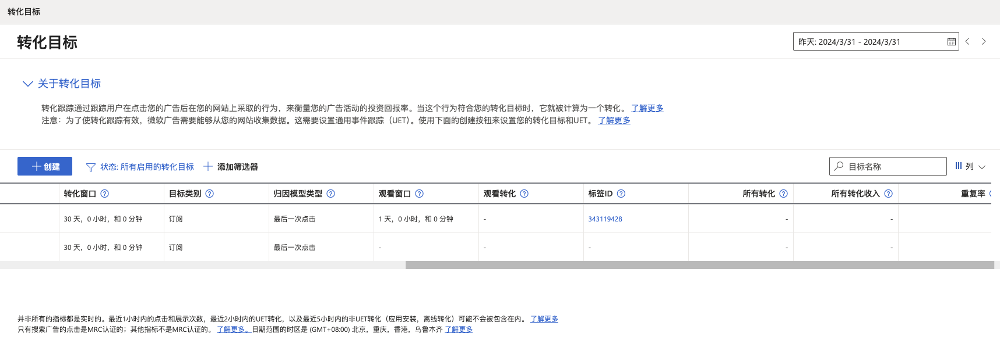
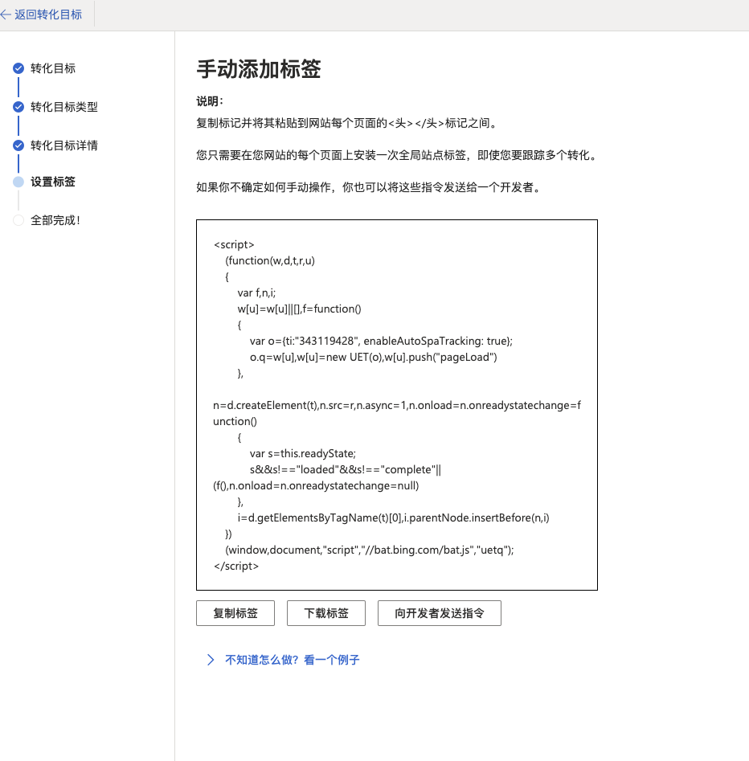
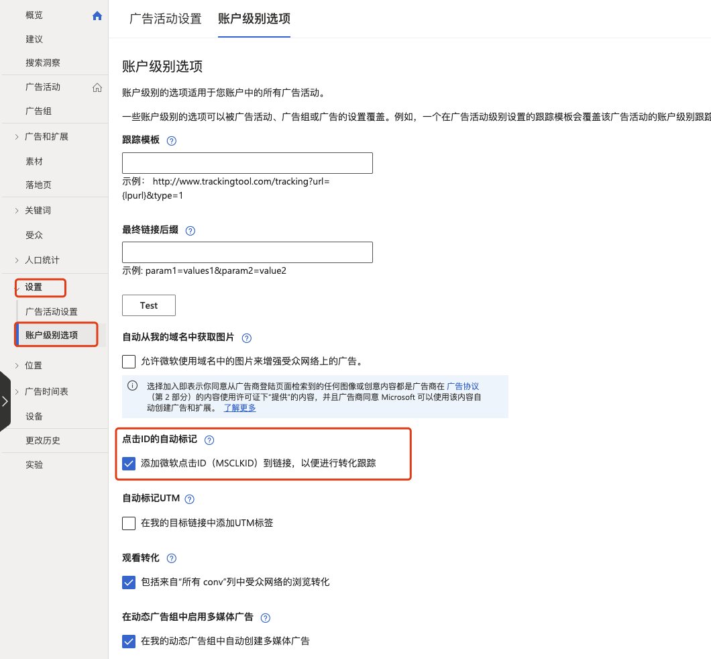
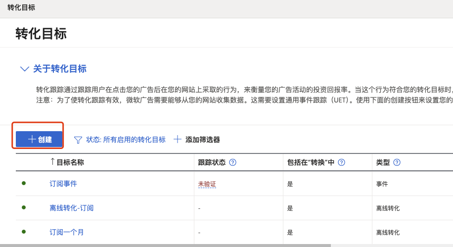
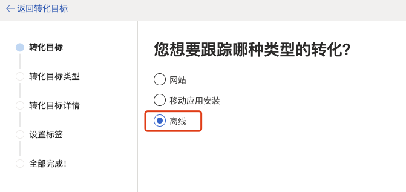
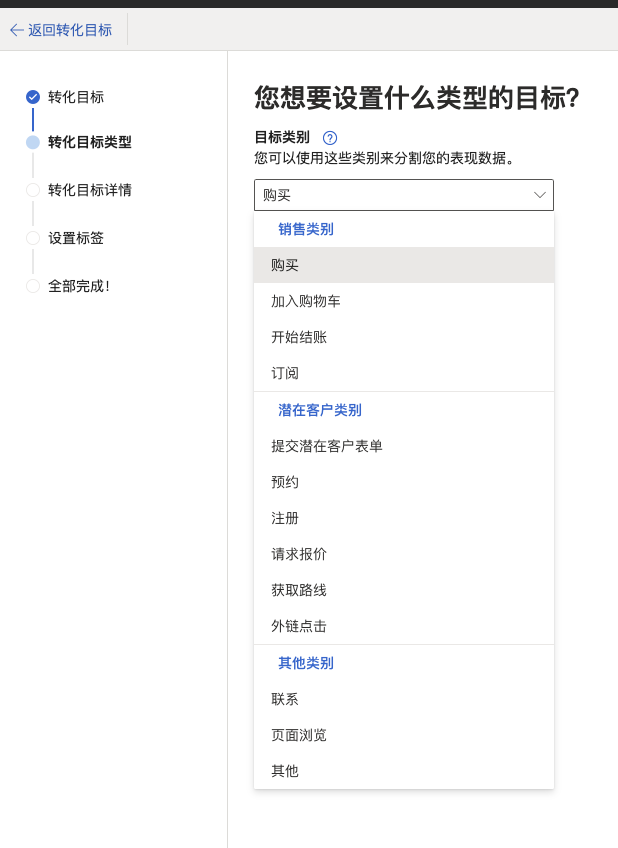
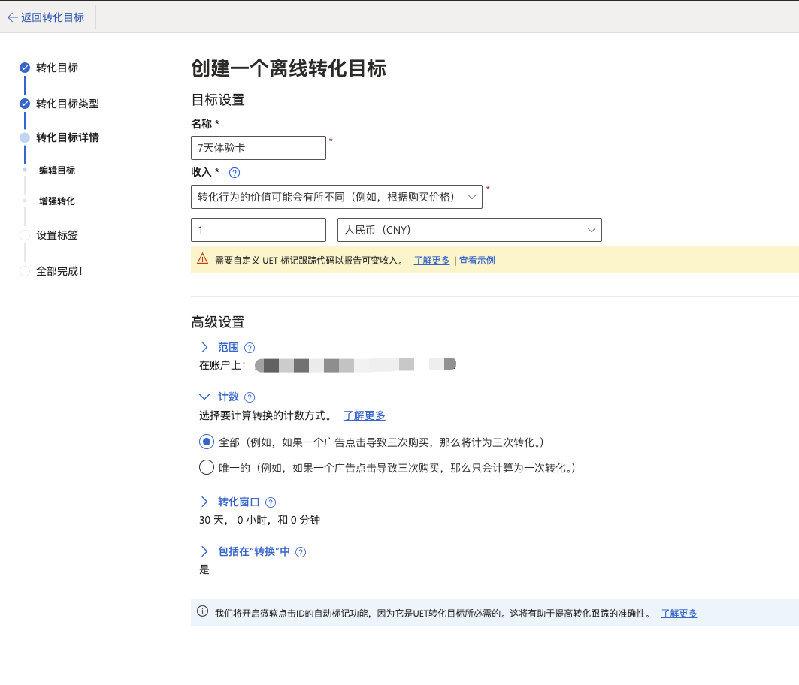
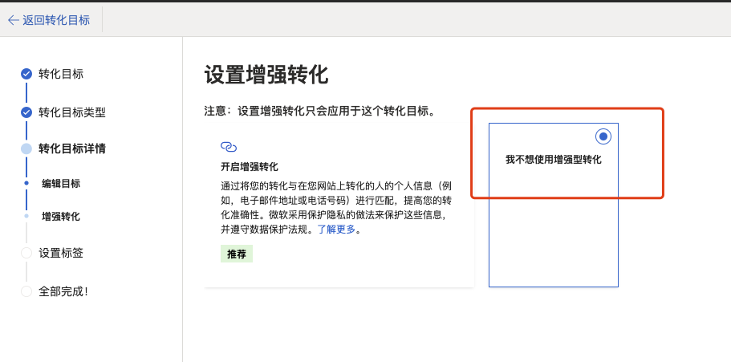

# Bing Ads API

请务必仔细阅读官方文档！API 文档地址：https://learn.microsoft.com/en-us/advertising/guides/?view=bingads-13

> 文档中可能有部分内容是过时的，或者未对中国用户做调整的地方，需对 API 进行仔细测试以甄别。

## 如何开始

文档地址：https://learn.microsoft.com/en-us/advertising/guides/get-started?view=bingads-13

### 注册一个 Web 应用程序

文档地址：https://learn.microsoft.com/en-us/advertising/guides/authentication-oauth-register?view=bingads-13

注意，需要放开权限，让「任何组织目录(任何 Microsoft Entra ID 租户 - 多租户)中的帐户和个人 Microsoft 帐户(例如 Skype、Xbox)」都有权限使用此应用。

重定向 URI 选择 Web 平台，输入一个 redirect_uri，比如 http://localhost:8080/auth

注册完成后，会得到 client_id 和 client_secret，以及一个自定义的 redirect_uri。

### 开发者令牌 developer_token

文档地址：https://learn.microsoft.com/en-us/advertising/guides/get-started?view=bingads-13#get-developer-token

在调用 Bing Ads API 时，不仅要拿到用户授权后的 access_token，还要用到开发者令牌 developer_token。

> 开发者令牌需要用户在微软 Ads 开发者门户页面上生成，只有超级管理员有权限生成这个，需联系一级代理商来生成。

### Demo

第一步，需要参考 https://github.com/wangbooth/BingAds-Python-SDK/blob/bing_cn/examples/v13/auth_helper.py，设置代码中的 CLIENT_ID、CLIENT_SECRET、REDIRECTION_URI 和 DEVELOPER_TOKEN 为实际值。

#### 账户基建 创建响应式搜索广告

可以参考 https://github.com/wangbooth/BingAds-Python-SDK/blob/bing_cn/examples/v13/responsive_search_ads.py，创建响应式搜索广告，实现账户基建工作。

#### 转化数据回传

# 转化跟踪

[转化跟踪](https://ui.ads.microsoft.com/campaign/vnext/conversiongoals?aid=176507923&ccuisrc=4&cid=253408536&uid=134481084)通过跟踪用户在点击您的广告后在您的网站上采取的行为，来衡量您的广告活动的投资回报率。当这个行为符合您的转化目标时，它就被计算为一个转化。

## 在线转化跟踪

在线转化跟踪，需要修改网站的代码，在网站的各个页面都插入 JavaScript 代码，在用户打开广告落地页时，JavaScript 程序将对应事件回传给 Bing。（不适合客户现状）

## 离线转化跟踪

离线转化跟踪无需修改网站代码，可由广告主自主控制何时将何数据回传给 Bing。

### MSCLKID

第一步，广告账户打开「点击 ID 的自动标记」：

此时，广告落地页的 URL 后会自动带上 MSCLKID 值，MSCLKID 是一个 32 位字符的全球唯一标识符，每次广告点击都是独一无二的，便于通过离线转化目标跟踪潜在客户。比如，原始的广告落地页 URL 设置为：`https://wenku.baidu.com/view/965197aa7cd184254b3535ee.html`，用户点击广告落地页时，跳转的链接为 `https://wenku.baidu.com/view/965197aa7cd184254b3535ee.html?msclkid=35b97407a01e114dbfd3120dd29e275c`

### 离线转化目标

创建离线转化目标：

目标类别可根据实际业务选择：

不要选择增强型转化，这个需要修改网站代码，不适合客户使用：

创建完成后，广告主后端可以通过[ApplyOfflineConversions API](https://learn.microsoft.com/en-us/advertising/campaign-management-service/applyofflineconversions?view=bingads-13) 来将订单或事件数据回传至Bing。

### API 调用回传离线转化数据

请求头数据准备：

- AuthenticationToken，广告账户 OAuth 认证过后的访问令牌
- CustomerAccountId，广告账户 ID
- CustomerId，客户 ID
- DeveloperToken，开发者令牌

请求数据准备：

- OfflineConversions
- - ConversionCurrencyCode， 转换货币代码，CNY
- - ConversionName，转化目标名称，在上一步创建的离线转化目标的名称
- - ConversionTime，转化发生的时间
- - ConversionValue，转化价值，可以是付款金额其他价值
- - MicrosoftClickId， MSCLKID

Python 代码示例：https://github.com/wangbooth/BingAds-Python-SDK/blob/bing_cn/examples/v13/offline_conversions.py

可以参考 [examples/v13/offline_conversions.py](https://github.com/wangbooth/BingAds-Python-SDK/blob/bing_cn/examples/v13/offline_conversions.py)，将转化数据回传至对应的转化目标。

